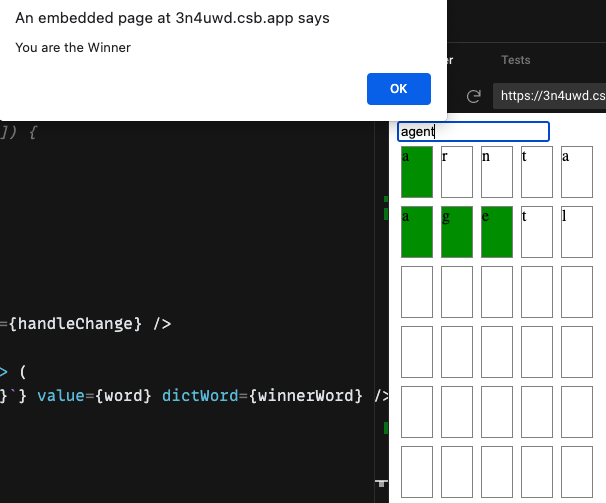

# Kraken word gussing game

This problem is the word gussing game.

The word's length is 5 and try 6 times.

In comparing gussing word with answer word, the right character is displayed in green , and wrong character is displalyed in white.

## For example.

 answerWord : drago

 gussingWord: daego

 In this case 'd', 'g', 'o' will displayed in green, and 'e', 'g' dispalyed in white

## Screenshot

